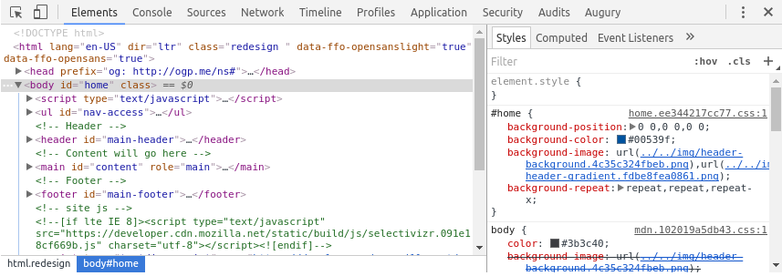

# Welcome to Augury

In this section you will learn about what Augury is and the features that are available. Later lessons in this guide will go into more detail, with each lesson that will have an accompanying demo Angular application.

Augury is an application inspection tool for Angular that runs in the Web browser. It runs as a Chrome browser _extension_ for the Developer Tools (DevTools) panel, aiding in analysis and debugging during development.

Augury provides insight into the application structure for an Angular application and the relationship between these building blocks:

* Components
* Services
* Routes
* Modules
* Dependencies
* Injectors
* Data bindings
* Events
* Object properties

Augury compliments DevTools during a debugging session, making it easy to modify state and emit events.

## Installing Augury

The best way to install Augury is from the [chrome web store](https://chrome.google.com/webstore/category/extensions?hl=en). Select _Extensions_ from the side panel, type "Augury" into the search field, and then press _Enter_.

The search result should list the Augury extension by _Rangle.io_:

When you click on "Add To Chrome", a _popup_ will open. Select "Add extension" to complete the process. Once the _plugin_ has been successfully installed, an Augury icon will appear next to the address bar in the browser.

The Augury icon provides additional information. Click on the icon now to discover what that is.

## Using Augury

To start using Augury, you must have an Angular application running in the browser for inspection. If you have never debugged a JavaScript application, you may not be aware that each modern Web browser provides a debug environment straight in the browser. _DevTools_, the debug environment is opened using the following _shortcut_:

* For Windows and Linux, use `Ctrl + Shift + I`
* For Mac OS X, use `Cmd + Opt + I`

When DevTools is opened, you will find the Augury tab on the far right.

## Augury features

We will quickly go over the main functionality that is available in Augury. This is to become familiar with the features and how to locate them when needed.

The first view that is visible is the _Component Tree_ which shows **loaded** components belonging to the application.

The component tree displays a hierarchical relationship of the _components_. When a _component_ is selected, Augury presents additional information about the selected _component_ in the _Properties_ tab.

Notable items of interest are:

1. View Source — a link to the source code of the component.
1. Change Detection — displays whether or not Change Detection is in use for the component.
1. Object Properties — lists the properties of the component.
1. Dependencies - lists the dependencies of the component.

To view the source code of the selected _component_, click the 'View Source' link. This will bring the _Sources_ tab into focus and display the source code.

### Source map

One thing to keep in mind, the _TypeScript_ code will only be shown if a _source map_ file exists. In production, if no _source map_ is found, what you will see is the compiled JavaScript code, which may also be minified and difficult to read.

Next to the _Properties_ tab is the _Injector Graph_, clicking on it will display the dependency of _components_ and _services_.

We will learn more about how to interpret the _Injector Graph_ in later lessons.

The final major feature of Augury is the _Router Tree_, which displays the routing information for the application. The _Router Tree_ tab is located next to the _Component Tree_ tab along the top left side.

There are a few things we didn't cover here such as data binding and events which will be covered in other lessons. However, you now have a basic understanding of Augury and how to start exploring its features with an Angular application.

Augury has evolved and improved over time since its debut, and it will continue to improve. We hope you will come to love Augury and make it an indispensable tool in your toolbox. We love and welcome all feedback, come join us on our [Slack channel](https://augury-slack.herokuapp.com).
