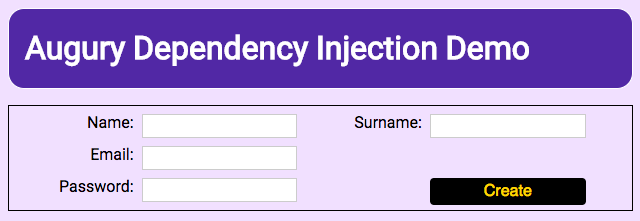
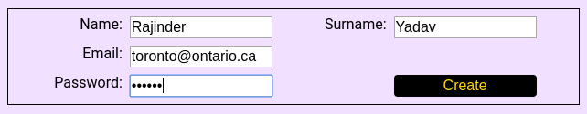
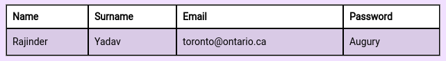
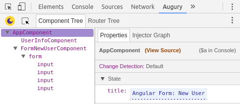
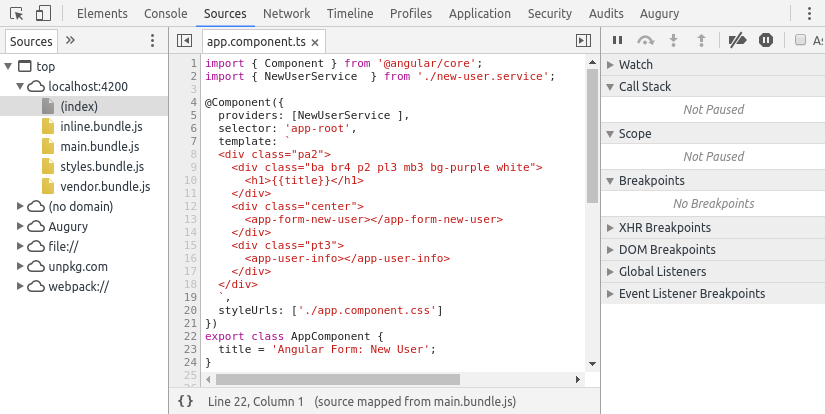
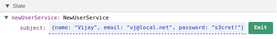

<a href="/examples/#/dependency-injection" target="blank">Launch Demo Application</a>

## Description

The _Dependency Injection_ application exemplifies using a simple Angular _template_ based _Form_ that uses a data _service_ to hold the submitted data. The data _service_ provides a data _stream_ to publish updates. A view _component_ subscribes to the data _stream_ and displays the most recent submitted user data in table format.

To display the _User_ data table, enter values in the _Form_ and click on the _Create_ button.



This will result in the data getting sent the _data service_ which then broadcasts the new data. The data view _component_ listens for updates from the data _service_ and presents the most recent data in a _table_ like the following.

.

## Application Structure

The _Dependency Injection_ application is composed of 3 _components_ and 1 _service_.

### Components

1. AppComponent
1. FormNewUserComponent
1. UserInfoComponet

### Service

- NewUserService

## Architecture

The Angular application makes use of _RxJS_ to create a data _stream_ to publish the _user_ data. When the _Create_ button is clicked, the user data is sent to the _service_ using an API call. The _service_ then publishes the data using an _RxJS Subject_.


The HTML Form is provided by _component_ `FormNewUserComponent`. The table view of the user info is handled by `UserInfoComponent`. It simply subscribes to the _Subject_ publishing the user data.

## Opening Augury

To use Augury, we must open DevTools first with the following keyboard shortcut.

```
Ctrl + Shift + I (Cmd + Opt + I on Mac)
```

When DevTools opens, select the **Augury** tab located on the far right. In DevTools, under the _Component Tree_ tab, you will see the following parent and children tree relationship for Angular _components_ and any HTML DOM _elements_.


The default view setting, called the _Hybrid view_, can be changed from the settings.


## Component View

Augury shows that the _Dependency Injection_ Angular application has 3 components. The _Root_ component is called `AppComponent` which in turn contains 2 child components, `UserInfoComponent` and `FormNewUserComponent`.

Select `AppComponent` from the _Component Tree_, on the right side in the _Properties_ tab, we see the single property `title` under _State_. Augury allows the value of property `title` to be modified. This is indicated by displaying an edit field with a dashed blue line on the bottom.



Feel free to change the value and press the _Enter_ key to see the change get reflected in the Web page.

## Viewing Source Code

In the _Properties_ tab, next to the name of the _component_ you will notice a clickable link called `(View Source)`. By clicking on it, DevTools will switch to the _Sources_ tab to show the TypeScript code of the selected _component_.

.

In the TypeScript code, you see `title` property assignment, which is what is displayed in Augury's _Properties_ tab.

```js
title = 'Angular Form: New User';
```

To return to Augury, click on the Augury tab.

## Dependency

Let us take a look at the `UserInfoComponent`, select it from the _Component Tree_. In the _Properties_ tab, we see that under _State_, the component has only one property `newUserService` and one dependency to `NewUserService`.


If we take a look at the source code, the class for the component actually has 2 members (properties), `userInfo` and `newUserService`.

```js
export class UserInfoComponent {

  userInfo;

  constructor( private newUserService: NewUserService ) {
    this.newUserService.getStream().subscribe(
      data => this.userInfo = data
    );
  }

}
```

Since property `userInfo` is not assigned a value, TypeScript removes it during compile, this is why the property is not seen in the _Properties_ tab. Likewise `newUserService` is assigned a value (a reference to the service) by the _Injector_ using Angular's Dependency Injection (DI).

Let us _publish_ a hand crafted user info using Augury. In the _Properties_ tab, under _State_ expand property `newUserService` as shown below so the _Emit_ button is visible.

Type in a JavaScript object with the fields, _name_, _email_ and _password_ containing some value.



When this data has been emitted, you will see this data displayed by the `UserInfoComponent` in a table.


In the _Properties_ tab, the _State_ should now look like this.


Since the `surname` field was left out from the emitted user info data, it shows up empty in the table on the Web page. Likewise it's missing under _State_ for object `userInfo`.

## Injector Graph

Besides looking at the source code to determine dependencies, Augury provides a visual way to see this through the _Injector Graph_ tab located next to the _Properties_ tab. If we select it, we will see a dependency tree.


For this new information to be useful, you need to understand how the _Injector_ graph is generated. It does not show the graph for the entire application. What gets shown is the dependency of the selected _component_ and its ancestry chain to the _Root injector_.

Further reading material of the [Injector Dependency Tree](https://angular.io/docs/ts/latest/guide/hierarchical-dependency-injection.html) can be found in the Angular guide.

### Understanding The Graph

Let us look at how to read the _Injector_ graph. At the top we have the _Root injector_, which is found in the `NgModule` at the root of the application.

In the code, looking at file `app.module.ts` we see 3 _components_ being declared by the root module as well as the one _service_ `NewUserService` that is registered with the _Root injector_.

```js
@NgModule({
  declarations: [AppComponent, FormNewUserComponent, UserInfoComponent],
  imports: [BrowserModule, FormsModule, HttpModule],
  providers: [NewUserService],
  bootstrap: [AppComponent]
})
export class AppModule {}
```

Looking at the graph, we see that `UserInfoComponent` is projected by `AppComponent`, the parent _component_. This is obvious if we look at the code (`app.component.ts`), in the _template_ string we see `<app-user-info>` being used.

```js
@Component({
  selector: 'app-root',
  template: `
...
    <div class="pt3">
      <app-user-info></app-user-info>
    </div>
...
`
})
export class AppComponent {
  title = 'Angular Form: New User';
}
```

Looking next at `UserInfoComponent`, we see a red line extending to the right, connecting to a circle labeled `NewUserService`. This denotes that _service_ `NewUserService` is being injected into _component_ `UserInfoComponent`.

The dashed blue line from the _Root injector_ to `NewUserService` indicates this _service_ is provided by the _Root injector_. This identifies the _service_ as being a _singleton_ (a global shared instance), that is available throughout the entire application.

### Colours

Pay close attention to the colours of the _components_ and _service_. For example, the circle is hollow for _service_. This means the _service_ is not provided by the _component_, instead it is being provided from an ancestor in the dependency tree.

### Parent Level Injector

Let us play around with _service_ registration. Instead of the _service_ being provided by the _Root_ injector, we are going to override this behaviour. Let us have `AppComponent` register the _service_ being used by `UserInfoComponent`. Open the file `app.component.ts` and add a `providers` array and `import` like this:

```js
import { NewUserService  } from './new-user.service';

@Component({
  providers: [NewUserService ],
  selector: 'app-root',
  ...
```

Now the _Injector_ graph looks like this:


The only thing that has changed is the dashed blue line, coming from `AppComponent` to the _service_. This as we should know now, indicates `NewUserService` is coming from the parent _injector_ of `AppComponent`.

### Component Level Injector

A _service_ can also be injected at the _component_ level. To see how this would look from the _Injector Graph_, we can make a simple code alteration to `UserInfoComponent` in the file `user-info.component.ts`.

In the `@Component` decorator, include the `providers` array like this:

```js
@Component({
  providers: [NewUserService ],
  selector: 'app-user-info',
  template: `
  ...
})
```

If we now look at the _Injector Graph_, we will see the dashed line has disappeared.


The `NewUserService` is being injected into `UserInfoComponent` as well as being registered with `UserInfoComponent`. Pay attention to the ball in the graph for the _service_, it has now become filled.

**Note**: These changes will break the code as the application no longer uses the same `singleton` _service_ to communicate data. This was for demonstration purpose only for the _Injector Graph_.
