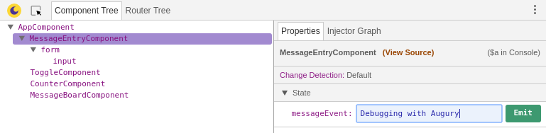
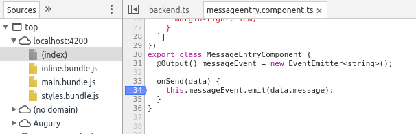
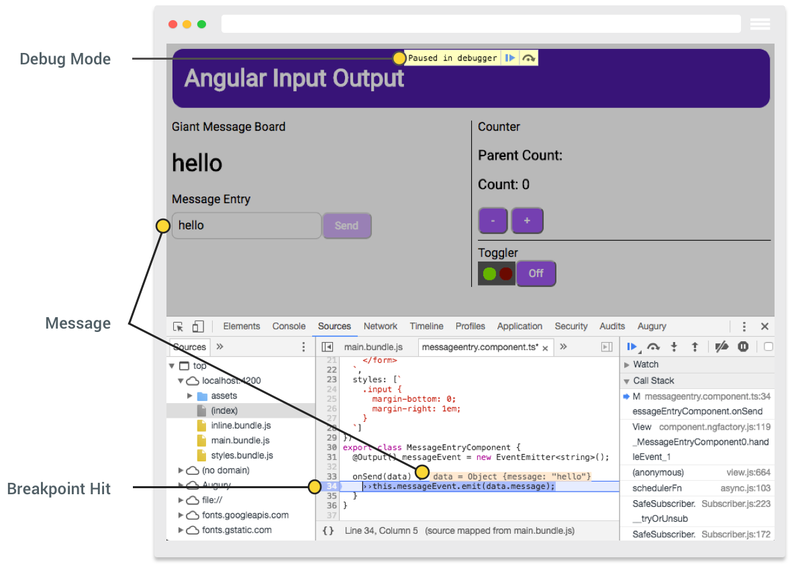

<a href="/examples/#/input-output" target="blank">Launch Demo Application</a>

## Description

The _Input Output Angular_ application demonstrates passing data inside a component as well as across components. The application makes uses of Angular input and output decorators as well as event and data binding.

The IO Application is composed of 5 components that are:

### Components

- Root Component
- Jumbo Message Board
- Message Entry
- Counter
- Toggle Button

## Architecture

The IO application _root_ component is `AppComponent`, it houses the other 4 components that each have a specific behaviour.

| Component               | Description                              |
| ----------------------- | ---------------------------------------- |
| `AppComponent`          | Root Component                           |
| `MessageBoardComponent` | Large message board.                     |
| `MessageEntryComponent` | Message entry form that emits a message. |
| `CounterComponent`      | A counter that emits a count value.      |
| `ToggleComponent`       | Toggle button with state lights.         |

## Opening Augury

To use Augury, we need to open DevTools.

```
Ctrl + Shift + I (Cmd + Opt + I on Mac)
```

When DevTools opens, select the _Augury_ tab located on the far right.

## Component view

Once Augury is opened, the component view is presented in the _Component Tree_. It shows all the available components in the application, along with their parent-child relationship. Below we see the list of components discussed in the architecture section earlier.

The application _root_ component `AppComponent` is listed at the top. Shifted slightly to the right and appearing under the _root_ component are all the children components.


In code, a child component is a component that appears inside a component's `template`. If we peek at the file `app.component.html`, we will see.

**Edited for readability**

```
...
    <div>
      <app-messageboard></app-messageboard>
    </div>
...
    <div>
      <app-messageentry></app-messageentry>
    </div>
...
    <div>
      <div>
        <app-counter></app-counter>
      </div>
...
      <app-toggle></app-toggle>
    </div>
```

If we select `AppComponent` inside the _Component Tree_, to the left inside the _Properties_ tab we see the component's properties under the _State_ group.


If you have looked through the example code for IO application, you will notice there is one property missing, that being the property `count`.

**app.component.ts**

```js
@Component({
  selector: 'app-root',
  templateUrl: './app.component.html',
  styleUrls: ['./app.component.css']
})
export class AppComponent {
  title = 'Angular Input Output';
  count: number;

  @Input() message = "Jumbo Shrimp!";

  ...
}
```

Augury will not show properties in a component if it not assigned a value, since TypeScript will simply compile it out. It is therefore suggested you assign a default value to each property. Having a property with an `undefined` value is poor coding practice and is an anti-pattern.

**Bad**

```js
class Foo {
  name: string;
}
```

**Good**

```js
class Foo {
  name: string = '';
}
```

In our example IO application, we have intentionally declared a property count with no assigned value to demonstrate the behaviour you would see in Augury. If you are not aware of why a property failed to appear, you might be confused.

However if we click on one of the counter buttons, this will initialize the count property with a value.

## Editing properties

In the _Properties_ tab, under _State_, an editable property will be displayed with a dashed underline. Let us change the `title` property of `AppComponent`.

1. Select `AppComponent` from _Component Tree_ tab.
1. Click on the text to the right of `title` from the _Properties_ tab.
1. Type "IO App" followed by the _Enter_ key.


## Firing events

The IO application has two components that emit an event. The `CounterComponent` and `MessageEntryComponent` have a event property decorated with `@Output()`, which has an `EventEmitter` attached to it.

We will look at `MessageEntryComponent`, start by selecting the component. In the Properties tab, you will notice `messageEntry` under State. Click and type a message, like "Debugging with Augury" and click on the Emit button.



You will notice in the IO app, under _Message Board_ the new message is displayed. By clicking on the _Emit_ button, an event was fired, in particular an event called `messageEvent`.

## Viewing source code

Augury provides a quick and convenient way to jump to the source code of a selected component. To do this, click on the _View Source_ link, it is located in the _Properties_ tab.


Following along from the previous step, with `MessageEntryComponent` selected, click on _View Source_. This will bring up the source code in DevTools by switching to the _Sources_ tab.

Earlier under section _Firing Events_ we emitted the `messageEvent` event. Looking at the source code, we can see this property is defined with the `@Output()` decorator.



If we want to convince ourselves that an event is triggered, we can set a breakpoint inside the event handler `onSend()` and emit a new event.



This concludes our journey of looking at the IO application with Augury. You should now feel more comfortable debugging input, output, property bindings and events in an Angular app.
