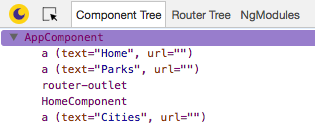

<a href="/examples/#/routes" target="blank">Launch Demo Application</a>

## Description

The _Routes_ Angular application demonstrates the uses of _routes_ as well as lazy loaded child routes. The application also makes use of multiple _router outlets_.

The application contains 10 components and 2 modules. The _root_ module `app.module.ts` contains the following components:

- AppComponent
- HomeComponent
- ParksComponent
- ParkOneComponent
- ParkTwoComponent
- ParkThreeComponent

The _city_ module `city.module.ts` contains:

- CityComponent
- CityOneComponent
- CityTwoComponent
- CityThreeComponent

## Architecture

The component code is simple, the `AppComponent` has a single router outlet. When the `ParksComponent` or `CityComponent` component is loaded, a second router outlet becomes available. Components from the child route get loaded into the second router outlet.


The _root_ module `app.module.ts` provides routes for _root_ and _parks_, which are:

| Routes         | Component (View)   |
| -------------- | ------------------ |
| `/`            | AppComponent       |
| `/home`        | HomeComponent      |
| `/parks`       | ParksComponent     |
| `/parks/park1` | ParkOneComponent   |
| `/parks/park2` | ParkTwoComponent   |
| `/parks/park3` | ParkThreeComponent |

The root path `/` gets redirected to `/home`. Also the lazy loaded route for `cities` is defined in the _root_ module.

The city module `city.module.ts` contains the routes for _cities_ below:

| Routes          | Component (View)   |
| --------------- | ------------------ |
| `/cities/city1` | CityOneComponent   |
| `/cities/city2` | CityTwoComponent   |
| `/cities/city3` | CityThreeComponent |

## Opening Augury

To use Augury, we need to open DevTools.

```
Ctrl + Shift + I (Cmd + Opt + I on Mac)
```

When DevTools opens, select the _Augury_ tab located on the far right.

## Router outlet

With Augury opened, in the _Component Tree_ `AppComponent` shows `router-outlet` as a child element, this makes sense since it is declared in the _template_.



In the browser, click on the _Parks_ button. This will load the `ParksComponent` and update the _Component Tree_ view. You will notice a second `router-outlet` that appears under `ParksComponent`, this is where each of the park components will load into.


Try clicking on each of the links labeled:

- Park 1
- Path 2
- Park 3

Notice how each child component is loaded under `ParksComponent` just underneath `router-outlet`. This is how Angular inserts a component into the DOM, as a sibling element of `router-outlet`.

## Routes

To see the current _routes_ for the application, click on the _Router Tree_ tab. This will show all the defined routes that are currently loaded in the application. The routes shows the path to each component (think view). The `AppComponent` path is the root `/`. The path to `HomeComponent` is `/home`, likewise the path to the child component `ParkThreeComponent` is `/parks/park3`.


Take a look at the bottom of the router tree, you will notice `cities [Lazy]`, this is a lazy loaded route. This means that the child components for the path `/cities` will be loaded on demand, this takes place when the _Cities_ button is clicked. Let us see this in action, click on the _Cities_ button and pay attention to how the _lazy route_ is updated when the feature Angular module is loaded.


That is all there is to Angular routes. We have looked at `router-outlet`, router tree and how it represents the path to the view and finally noticing lazy loaded routes.

As shown in both images there is a route called `no-name-route` these usually occur when Augury is not able to find a proper name for the route. The way Augury detects the name of a route is through:

1. Checking if a component is connected to the route. If so, use the name of that component
2. If there is no component, Augury checks if it's a _lazy route_, if so it will specify the name as `path + [Lazy]`, example `cities [Lazy]`
3. If there is no component and it's not a _lazy route_. Augury will check if it's a redirect route, if it is - Augury will return `path -> redirecting to -> redirectPath` example `cities -> redirecting to -> /cities/home`
4. If none of the above matches, Augury will return `no-name-route`, ideally this shouldn't happen.
