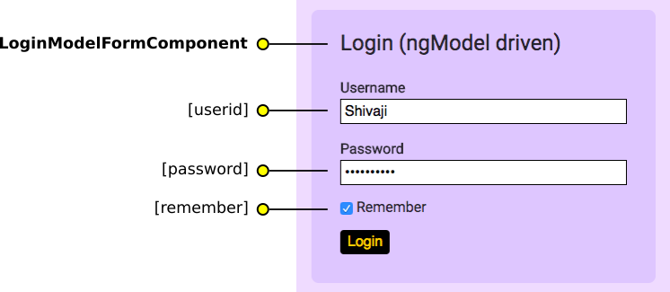
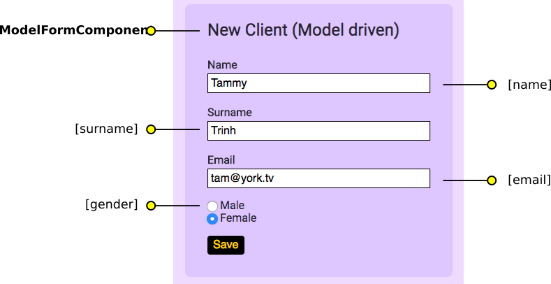

## Description

The _Forms_ Angular demo application displays three _forms_ that we shall make use of Augury to explore. The first _form_ is a simple `template` based login form with no validation. The second is the same as the first, but uses `ngModel` property binding. The third _form_, _New Client_ is also model driven, however it uses `FormBuilder` to bind and initialize form data. The _New Client_ form also uses input validation.

Both applications log the submitted data to the debug console, which can be viewed using _devtools_.

### Components

The _Froms_ application has three components.

* AppComponent
* LoginFormComponent
* LoginModelFormComponent
* ModelFromComponent

## Architecture

The first _form_ is simple and has a single component `LoginFormComponent`.

The second _form_ is based off the first and makes use of `ngModel` two-way property bindings. The three properties are shown with their names.



The third _form_



## Opening Augury

To use Augury, we need to open DevTools.

```
Ctrl + Shift + I (Cmd + Opt + I on Mac)
```

When DevTools opens, select the _Augury_ tab located on the far right.

## Component view

There are three child components displayed in the _Component Tree_, each component is a container for a single Angular form. We will start by selecting the component `LoginFormComponent` from _Component Tree_. Looking at the expanded tree, we see a `form` element with three `input` elements.
