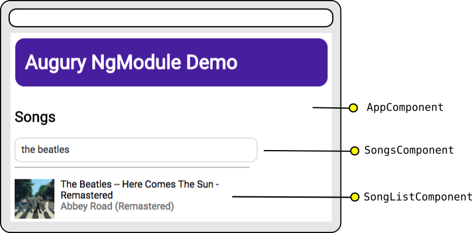
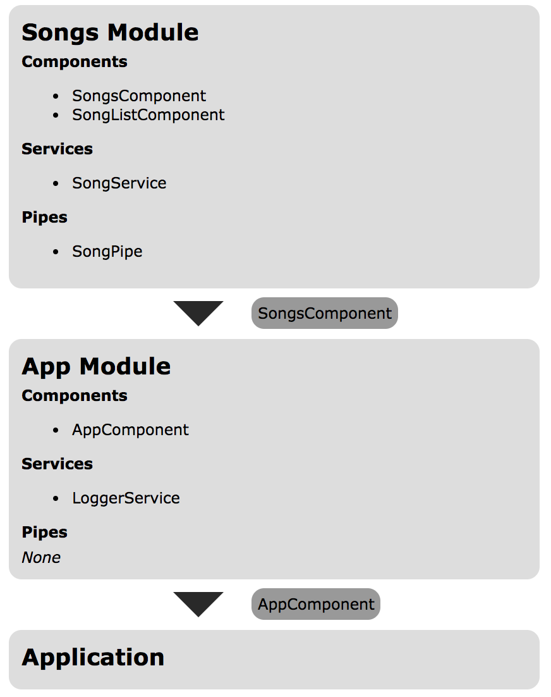
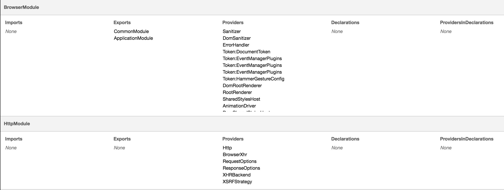
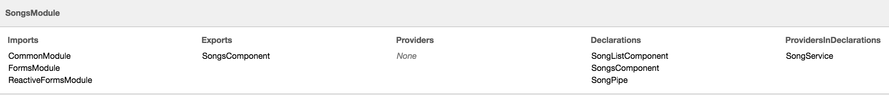

<a href="/examples/#/modules" target="_blank">Launch Demo Application</a>

## Description

We will use a simple Angular application, _Song List_ to examine how to use Augury's module list feature. The application includes a simple form for the user to search for songs and will use the public Spotify API to get the results and display the album art and song title in a list.

## Architecture

The _Song List_ application is composed of two modules. One, the root application module which is used to bootstrap and launch the application. The second is a single feature module that contains the components, services, and pipes relevant for the searching and displaying of song data. Lets take a look at how this is organized:



The Songs Module is a _feature_ module, which exports a component, `SongsComponent` that can be used throughtout the application. This is used in the `AppComponent`, which is our _root_ component that will bootstrap the application.

The architecture of the _Song Module_ is pretty straightforward. The `SongsComponent` contains the search field in its _template_, and has the `SongService` injected as a dependency. When the user searches for a term, the `SongService` is invoked to perform a GET request, which returns an array of results. This dataset is passed to the `SongListComponent` which will use the `SongPipe` to display the album art, song title, and the name of the artist.

Now that we understand the basic architecture of the _Song List_ application, lets open Augury and explore the _Module List_ feature.

## Opening Augury

To use Augury, lets open up DevTools with the following shortcut:

```
Ctrl + Shift + I (Cmd + Opt + I on Mac)
```

When the DevTools panel opens, select the Augury tab located on the far right. By default the _Component Tree_ tab will be open. To the far right, there will be a tab labeled _NgModules_. This is the section we want so click on it to open it up!

## Root Module


The _Module List_ feature lists all the modules in the application. The first module in this list is the `AppModule`. Here we can see what _imports_, _exports_, _providers_, _declarations_, and _providers in declarations_ are found in the module. Our `AppModule` imports the `BrowserModule` (used for bootstrapping), `HttpModule` (used for performing network requests) and our feature module, `SongsModule`. Since the `AppModule` contains the application's root component it doesn't need to export anything. The `AppModule` has a single Provider, `LoggerService` which is a simple service used for logging messages. Finally, the `AppModule` has one component, `AppComponent` which is the root component of our application and as such is the bootstrap entry point.

To see where Augury gets this information from, open up `app.module.ts` and take a look at the `AppModule` source code:

```js
import { BrowserModule } from '@angular/platform-browser';
import { NgModule } from '@angular/core';
import { HttpModule } from '@angular/http';

import { AppComponent } from './app.component';

import { Logger } from './services/logger.service';

import { SongsModule } from './modules/songs.module';

@NgModule({
  declarations: [AppComponent],
  imports: [BrowserModule, HttpModule, SongsModule],
  providers: [Logger],
  bootstrap: [AppComponent]
})
export class AppModule {}
```

As you can see, the information that Augury has picked out and displayed in the _Module List_ comes directly from the `NgModule` definition.

Declarations include the components, directives, and pipes used by the module.

Imports are the other modules and their exported declarations that we want to be made available in this module.

Providers list the services used by this module. Any service included as a provider in the `NgModel` definition becomes available to any other module in the hierarchical dependency injection system. For example, the `SongsModule` includes the `SongService` as a provider, since `AppModule` has imported the `SongsModule` it can now use the `SongService`. If we omitted the `SongService` from the `NgModel` definition of the `SongsModel` and instead opted to include the `SongService` in the provider definition of the `SongsComponent`, the `AppModule` will not have access to the `SongService`. Dependency Injection is a topic outside the scope of this guide, but you can read more about it on the [Angular 2 Documentation](https://angular.io/docs/ts/latest/guide/hierarchical-dependency-injection.html)

So now that we've taken a look at the root module of our application, let us continue on to the other modules in Augury's module list.

## Library Modules

Angular comes with a bunch of essential modules that we use for creating forms, making HTTP requests, and specifying what environment our application should run under. In the root module we imported the _BrowserModule_ and _HttpModule_.



Since library modules are static, there really isn't much in the way of useful information here, particularly for this application. However there may come a time where you need to debug a certain library module and given the complexity and size of such modules getting a breakdown of its `providers`, `exports` and `declarations` may come in handy.

## Feature Module

Finally, lets take a look at our feature module, `SongsModule`.


As we can see, the `SongsModule` uses three library modules. `FormsModule` and `ReactiveFormsModule` are used for building the search form, and `CommonModule` contains many of the common directives used in the applications templates.

Feature modules can be thought of as extending the functionality of an application by introducing a new feature. Since this is a feature module, it will be imported by another module (in this case the root module). However not all declarations from the `SongsModule` need to be used elsewhere. The `SongListComponent` and `SongPipe` are really only used within the `SongsModule`, so we export our main container for this module, `SongsComponent`.

The `SongsModule` also uses the `SongService` as seen under the provider section.

Let us take a look at the definition of the Song Module, open up `src/app/modules/songs.module.ts`:

```js
import { NgModule } from '@angular/core';
import { CommonModule } from '@angular/common';
import { FormsModule, ReactiveFormsModule } from '@angular/forms';

import { SongPipe } from '../pipes/song.pipe';
import { SongListComponent } from '../components/song-list/song-list.component';
import { SongsComponent } from '../components/songs/songs.component';

import { SongService } from '../services/songs.service';

@NgModule({
  imports: [CommonModule, FormsModule, ReactiveFormsModule],
  declarations: [SongListComponent, SongsComponent, SongPipe],
  providers: [SongService],
  exports: [SongsComponent]
})
export class SongsModule {}
```

Just like our root module, Augury has picked out the `imports`, `declarations`, `providers` and `exports` information from our module definition.

One important thing to take note of is that _Module List_ does not include any resources (pipes, providers, directives, components, etc) that a module may use, just the resources defined by `NgModule`. For example, open up the `SongListComponent` (`components/song-list/song-list.component.ts`), here is what it should look like:

```js
export class SongListComponent {
  @Input() songs: any;

  ngOnChanges() {
    if (this.songs) {
      this.logger.info('song list changed!');
    }
  }

  constructor(private logger: Logger) {
  }
}
```

The `SongListComponent` uses the `Logger` service via dependency injection that has been made available from the `AppModule`. Since the `AppModule` is at the root of the application's dependency injection hierarchy, the `SongListComponent` can use any of its providers. However, since the `Logger service` is defined in the `AppModule`, Augury will list this service under the providers section of the `AppModule`. It is not included in the section of the `SongsModule`, even though the `SongsModule` uses this service. To get a better sense of dependency injection throughout our application we should use Augury's Dependency Injection Tree.

Let us see what happens when we remove the `SongService` from the provider list in the `SongModule` definition and move it to the provider list in the `SongsComponent` component definition. Here is what `SongsComponent` will look like:

```js
@Component({
  selector: 'my-songs',
  styleUrls: ['./songs.component.css'],
  providers: [SongService],
  template: `
  	<h2>Songs</h2>
    <form [formGroup]="searchForm">
    	<input
        	#searchInput
            class="search"
            formControlName="artist"
            debounce="400"
            placeholder="Search for artist"
            (keyup)="search()" />
    </form>
    <hr />
    <song-list [songs]="songs"></song-list>
  `
})
export class SongsComponent { ...
```

Augury has picked up what we've done and has noticed that the `SongService` is no longer a provider from the module level, but instead from the component level. As we can see below, `SongService` is now under the _ProvidersInDeclarations_ section.



This comes in handy as Auguary is able to pick up and list all services that a module provides, whether or not they are included in the module providers, or via specific component providers.
